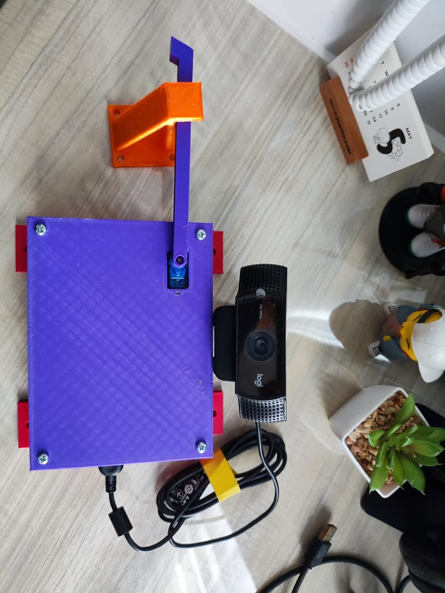
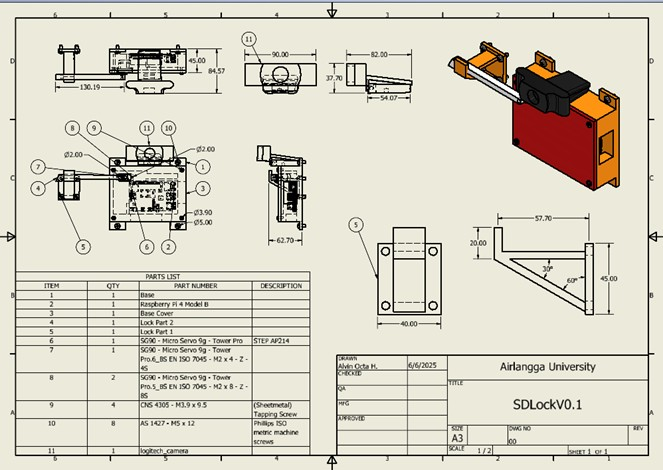
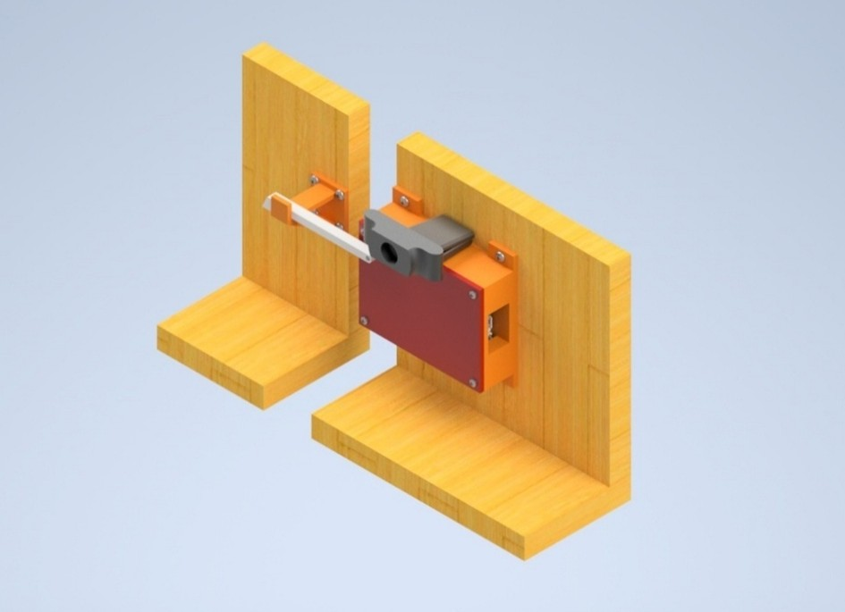
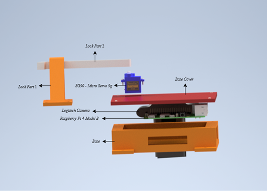
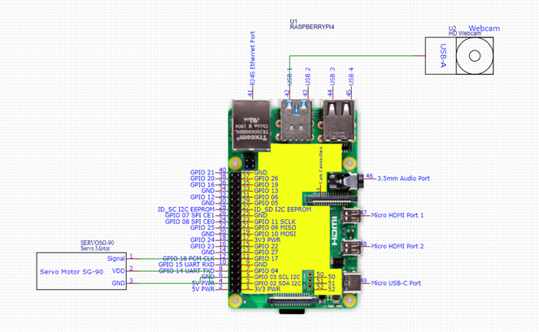

# Smart Door Lock — Face Recognition System

A face recognition-based smart door lock system that replaces traditional key-based access with biometric authentication. Built as an undergraduate thesis project at Universitas Airlangga (2025).


> **Thesis:** Design and Development of a Smart Door Lock System Based on Face Recognition Using MTCNN-InceptionResNet
> **Institution:** Robotics & AI Engineering, Universitas Airlangga (2025)

---

## Demo

<!-- Add your demo GIF here after converting from video -->


*End-to-end flow: face detected → anti-spoofing check → identity matched → servo unlocks.*

---

## Hardware

### Physical Prototype


*3D-printed enclosure housing Raspberry Pi 4B, SG90 servo motor, and Logitech C922 webcam.*

### System Design
| CAD & Technical Drawing | 3D Render on Door |
|---|---|
|  |  |

### Exploded View


*Component breakdown: Base → Raspberry Pi 4B → Logitech Camera → SG90 Servo → Lock Part 1 & 2 → Base Cover.*

### Wiring Diagram


*SG90 servo signal wire → GPIO18 (Pin 12). Webcam connected via USB-A.*

---

## System Architecture

```
┌─────────────────────────────────┐         ┌─────────────────────────────────────┐
│        Raspberry Pi 4B          │         │       Server (Google Colab)         │
│                                 │         │                                     │
│  Logitech C922 Webcam           │         │  ┌──────────────────────────────┐  │
│         │                       │  HTTP   │  │  POST /register_face         │  │
│  Capture frame.jpg              │ ──────► │  │  POST /face_recognition      │  │
│         │                       │         │  └──────────────────────────────┘  │
│  requests.post(ngrok_url)       │         │                │                   │
│         │                       │ ◄─────  │  1. MTCNN — Face Detection         │
│  Parse JSON response            │  JSON   │  2. DualInputCNN — Anti-Spoofing   │
│         │                       │         │  3. InceptionResNetV1 — Embedding  │
│  if success:                    │         │  4. Euclidean Distance Matching    │
│    pigpio → Servo SG90 → 90°   │         │  → JSON { status, name }           │
│    time.sleep(5) → back to 0°  │         └─────────────────────────────────────┘
└─────────────────────────────────┘
         ↕
    config.txt
  (ngrok public URL)
```

---

## Key Results

| Component | Metric | Value |
|---|---|---|
| **Face Detection (MTCNN)** | Precision / Recall / F1 | **1.0 / 1.0 / 1.0** (4 lighting conditions) |
| **Face Recognition (InceptionResNetV1)** | False Acceptance Rate (FAR) | 9.1% @ threshold 0.8 |
| **Face Recognition (InceptionResNetV1)** | False Rejection Rate (FRR) | 10.5% @ threshold 0.8 |
| **Anti-Spoofing (DualInputCNN)** | Test accuracy | 82.4% |
| **System Response Time** | Avg. end-to-end latency | 1.494s @ 23.49 Mbps |

---

## Models

### 1. Face Detection — MTCNN

Multi-Task Cascaded CNN (P-Net → R-Net → O-Net) from `facenet-pytorch`. Handles varying lighting (10–2000 lux), partial occlusion, and accessories.

```python
from facenet_pytorch import MTCNN
mtcnn = MTCNN(image_size=240, margin=0, device=device)
boxes, _ = mtcnn.detect(image)  # Returns bounding boxes
```

### 2. Face Recognition — InceptionResNetV1

Pre-trained on VGGFace2 (3M+ images, 9k+ identities). Produces 512-dim embeddings compared via Euclidean distance. Best threshold: **0.8** (FAR 9.1%, FRR 10.5%, avg F1-score 0.87).

```python
from facenet_pytorch import InceptionResnetV1
resnet = InceptionResnetV1(pretrained='vggface2').eval().to(device)
embedding = resnet(face_tensor.unsqueeze(0))  # shape: [1, 512]
```

### 3. Anti-Spoofing — DualInputCNN

Custom CNN with dual parallel branches (RGB + LBP) fused before classification:

```
RGB Input (3×240×240)  →  Conv64 → Conv128 → Conv256 → Dropout(0.2)  ─┐
                                                                         ├→ Concat → Conv512 → FC512 → FC128 → FC2
LBP Input (1×240×240)  →  Conv64 → Conv128 → Conv256 → Dropout(0.2)  ─┘
```

LBP computed with `skimage.feature.local_binary_pattern(gray, P=8, R=1, method='uniform')`.

| Stage | Dataset | lr | Max Epochs | Patience |
|---|---|---|---|---|
| Initial training | nguyenkhoa/antispoofing-3 (8,000 imgs) | 1e-4 | 200 | 20 |
| Fine-tuning | Primary webcam data | 1e-5 | 100 | 10 |

---

## Hardware Requirements

| Component | Specification |
|---|---|
| Edge device | Raspberry Pi 4 Model B (4GB RAM) |
| Camera | Logitech C922 Pro HD Stream (1080p@30fps) |
| Actuator | TowerPro SG90 Servo Motor (GPIO18 / Pin 12) |
| Connectivity | LAN Cat 6 or WiFi (recommended ≥ 20 Mbps) |

**Servo wiring (SG90):** Grey → GND · Red → VCC (4.8–7.2V) · Orange → GPIO18

Pulse width mapping: `pw = 500 + ((180 - angle) / 180.0) * 2000` µs

---

## Software Requirements

```bash
# Server (Google Colab)
pip install facenet-pytorch flask pyngrok scikit-image torch torchvision pillow numpy grad-cam

# Raspberry Pi
pip install opencv-python requests pigpio
```

---

## Project Structure

```
smart-door-lock/
├── src/
│   ├── train_model_anti_spoofing.ipynb      # DualInputCNN training + fine-tuning (Colab)
│   ├── colab_face_recognition.ipynb         # Flask inference server (Colab + ngrok)
│   ├── raspberry_pi_register_face.py        # Face enrollment client (Raspberry Pi)
│   └── raspberry_pi_face_recognition.py     # Main door lock loop (Raspberry Pi)
├── assets/
│   ├── hardware_setup.jpg                   # Physical prototype photo
│   ├── technical_drawing.jpg                # CAD engineering drawing
│   ├── system_render.jpg                    # 3D render on door
│   ├── exploded_view.png                    # Labelled component exploded view
│   ├── wiring_diagram.png                   # Raspberry Pi GPIO wiring
│   └── demo_recognition.gif                 # Live recognition demo
├── config.txt                               # Paste your ngrok URL here each Colab session
└── README.md
```

---

## Getting Started

### Step 1 — Clone the repo

```bash
git clone https://github.com/AlvinOctaH/smart-door-lock.git
cd smart-door-lock
```

### Configure ngrok URL

Create a `config.txt` file in the root directory to store the ngrok public URL generated by the Colab server:

```
https://xxxx-xx-xx-xxx-xx.ngrok-free.app
```

> This file is read by `raspberry_pi_face_recognition.py` and `raspberry_pi_register_face.py` at runtime to know where to send requests. Update it every time you restart the Colab server, as ngrok generates a new URL each session.

### Step 2 — Start the inference server (Google Colab)

1. Open `src/colab_face_recognition.ipynb` in Google Colab
2. Mount Google Drive — model weights (`dual_input_cnn_finetuned.pth`) and face database (`face_database.pkl`) load from there
3. Set your ngrok auth token:

```python
from pyngrok import conf
conf.get_default().auth_token = "YOUR_NGROK_TOKEN"
```

4. Run all cells — the public URL prints as `* Ngrok URL: https://xxxx.ngrok-free.app`
5. Copy the URL into `config.txt` on your Raspberry Pi

> ⚠️ The ngrok URL changes every Colab session. Update `config.txt` each time.

### Step 3 — Start the pigpio daemon (Raspberry Pi)

```bash
sudo pigpiod
```

### Step 4 — Register a face

```bash
python src/raspberry_pi_register_face.py
# Camera window opens (480×360)
# Press 's' to capture · Enter your name when prompted
# Embedding stored in face_database.pkl on Google Drive
```

### Step 5 — Run the door lock

```bash
python src/raspberry_pi_face_recognition.py
# Live camera feed shown in 480×360 window
# On success: servo → 90° → waits 5s → returns to 0°
# Press 'q' to quit
```

---

## API Reference

Both endpoints served by `colab_face_recognition.ipynb`.

### `POST /register_face`

| Parameter | Type | Description |
|---|---|---|
| `image` | file | Face image (JPEG/PNG) |
| `name` | string | Name label for this face |

```json
{ "status": "success", "message": "Face registered for Alvin" }
```

### `POST /face_recognition`

| Parameter | Type | Description |
|---|---|---|
| `image` | file | Webcam frame (JPEG) |

```json
{ "status": "success", "name": "Alvin" }
{ "status": "failed", "message": "Spoof detected" }
{ "status": "failed", "message": "Face not recognized" }
```

---

## Limitations

- **Anti-spoofing real-world rate:** 70% (7/10). Fails on high-quality face photos displayed on a smartphone screen at full focus.
- **Accessories:** Recognition drops significantly with sunglasses or masks (F1 ~0.4–0.5).
- **Internet dependency:** Response time scales with bandwidth — 1.494s @ 23.49 Mbps, 1.825s @ 15.31 Mbps.
- **ngrok URL lifecycle:** URL expires on Colab disconnect; `config.txt` must be updated manually each session.

---

## Future Work

- Replace DualInputCNN with pretrained models: **MobileNetV3-CDCN**, **DINO-ViT**, or **CDCN++**
- Add spatio-temporal features for video replay attack detection
- Deploy full local inference on **Raspberry Pi 5 + AI Kit** or **NVIDIA Jetson Orin Nano**
- Use a persistent server to eliminate ngrok URL rotation

---

## Citation

```bibtex
@misc{hidayathullah2025smartdoorlock,
  author = {Alvin Octa Hidayathullah},
  title  = {Design and Development of a Smart Door Lock System Based on Face Recognition Using MTCNN-InceptionResNet},
  year   = {2025},
  school = {Universitas Airlangga},
  note   = {Undergraduate Thesis},
  url    = {https://github.com/AlvinOctaH/smart-door-lock}
}
```

---

## Author

**Alvin Octa Hidayathullah**
B.Eng. Robotics & AI Engineering, Universitas Airlangga

[](https://github.com/AlvinOctaH)

---

## Acknowledgements

- **Amila Sofiah, S.T., M.T.** — Supervisor I
- **Dr. Maryamah, S.Kom.** — Supervisor II
- [facenet-pytorch](https://github.com/timesler/facenet-pytorch) by Timothy Esler
- Dataset: [nguyenkhoa/antispoofing-3](https://huggingface.co/datasets/nguyenkhoa/antispoofing-3)

---

## License

This project is licensed under the MIT License — see [LICENSE](LICENSE) for details.
